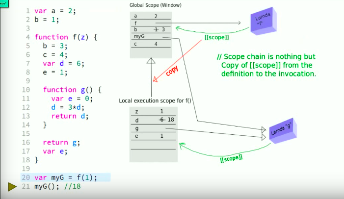

# JavaScript作用域&&闭包

## 一、作用域空间、变量提升hoisting
JavaScript中只存在function级作用域,ES6支持let,const用于创建block作用域，**在循环+异步调用** 时经常使用。
* 变量提升
``` JavaScript
    a = 2;
    var a;
    console.log(a); //2
```
* 函数提升
```JavaScript
    console.log(f1); // 函数声明式 发生函数提升
    console.log(f2); //undefined
    function f1(){}; //函数声明式
    var f2 = function(){} //函数字面量
```
### 总结:
1. var a = 2;其中var a在**编译阶段**，a=2在**执行阶段**;
2. 不加var，直接写a = 2,发生在**运行阶段**引擎会沿着[[scope]],一直查找到全局作用域，如果没有找到，则在window的全局作用域下创建变量 a
3. 无论作用域中的声明（变量和函数）出现在什么地方，都将在代码本身执行前首先进行处理；
4. 声明本身会被提升，而包括函数表达式的赋值在内的赋值操作并不会提升；
5. 函数会首先被提升，然后才是变量，重复的var（变量）声明会被忽略掉；
6. 后面的函数声明可以覆盖前面的。
### PS：
1. RHS查询在所有嵌套的作用域中遍寻不到所需遍历会抛出**ReferenceError**。
2. RHS查询到一个变量，但你尝试对其不合理的操作（引用null或undefined类型中的属性），会抛出**TypeError**。

## 二、词法作用域、作用域链[[scope]]
作用域是关于**引擎**如何**寻找变量**以及会在何处找到变量的规则
- 词法作用域

    - 最重要特征是定义过程发生在代码书写截断

    - 作用域链基于代码的作用域嵌套而非调用栈

- 动态作用域是让作用域在代码运行过程中动态确定(C++、JAVA)

    - 不关心函数和作用域如何声明以及何处声明

    - 只关心从何处调用

    - 作用域链基于调用栈而不是代码的作用域嵌套

- JS 并不具有动态作用域只有词法作用域 -> this机制某种程度上很像动态作用域

 <br/>
### 图解说明
 1. 为了表示不同的**运行环境**，JavaScript中有一个执行上下文（Execution context，EC）的概念。也就是说，当JavaScript代码执行的时候，会进入不同的执行上下文，这些执行上下文就构成了一个执行上下文栈（Execution context stack，ECS）
 
 2. **函数是在 调用的时候 才会去创建EC，函数调用结束销毁EC中的内容**

 3. VO/AO 标准中函数[pointer to Function] 会存在一个 __parent__ 属性指向当前的 VO,函数执行时


## 三、闭包closure
### 一些关于闭包的定义：

	1. 闭包是指有权访问另一个函数作用域中变量的函数 --《JS高级程序设计第三版》 p178
	2. 函数对象可以通过作用域链相关联起来，函数体内部的变量都可以保存在函数作用域内，这种特性称为 ‘闭包’ 。 --《JS权威指南》 p183
	3. 内部函数可以访问定义它们的外部函数的参数和变量(除了this和arguments)。 --《JS语言精粹》 p36

### 定义总结

	1. 可以访问外部函数作用域中变量的函数
	2. 被内部函数访问的外部函数的变量可以保存在外部函数作用域内而不被回收---这是核心，后面我们遇到闭包都要想到，我们重点要关注被闭包引用的这个变量。


>只有当inner function引用了外层的变量时，该closure才会创建,实质上是在function expicity(显示的)添加了一个closure 引用属性 指向上级作用域空间

## 四、闭包与内存管理
### [函数执行过程](http://www.cnblogs.com/wilber2013/p/4909505.html ) 这是链接请点击查看
* 执行上下文 EC
  - javascript 函数在执行时，为了表示不同的运行环境，而创建的一个对象，里面包含 VO/AO,[[scope]]
* 执行上下文栈 ECS
* VO(Variable object) 
* AO(Activation object)
* 作用域链[[scope]]

### 当一段JavaScript代码执行的时候，JavaScript解释器会创建Execution Context，其实这里会有两个阶段：

* 创建阶段（当函数被调用，但是开始执行函数内部代码之前）
    * 创建Scope chain
    * 创建VO/AO（variables, functions and arguments）**变量提升**
    * 设置this的值
* 激活/代码执行阶段
    * 设置变量的值、函数的引用，然后解释/执行代码
``` javascript
(function(){
    console.log(bar); //在执行阶段，本地VA 及 [[scope]]未出现该变量 -->output:undefined
    console.log(baz); //函数声明 baz 在本地的VA当中 -->打印函数
    
    bar = 20; //运行时，沿着[[scope]]往上，直到global content，才创建了这个变量 bar
    console.log(window.bar);//执行到这一句，全局变量 bar已经创建 -->output:20
    console.log(bar);
    
    function baz(){
        console.log("baz");
    }
    
})()
//demo-02:
(function(){
    console.log(foo);
    console.log(bar);
    console.log(baz);
    
    var foo = function(){};
    
    function bar(){
        console.log("bar");
    }
    
    var bar = 20;
    console.log(bar);
    
    function baz(){
        console.log("baz");
    }
    
})();
/* 解释说明：
在创建VO/AO过程中，解释器会先扫描[函数声明]，然后"bar: <function>"就被保存在了AO中；但解释器扫描变量声明的时候，虽然发现"var bar = 20;"，但是因为"bar"在AO中已经存在，所以就没有任何操作了。所以第一次打印是 functio                                                                                                                                                                                                                                                                                                                                                                                                                                                                                                                                                                                                                                                                                                                                                                                                                                                                                                                                                                                                                                                                                                                                                                                                                                                                                                                                                                                                                                                                                                                                                                                                                                                                                                                                                                                                                                                                                                                                                                                                                                                                                                                                                                                                                                                                                                                                                                                                                                                                                                                                                                                                                                                                                                                                                                                                                                                                                                                                                 n bar(){}
*/
```
> 标记及清除：解决循环引用

 <br/>

---
 <br/>

## 五、this动态绑定的特性 (call,apply,bind)

> JavaScript中的函数运行在它们被**定义时的作用域里**,而不是它们被执行的作用域里。

### 关于this解释
* **this是执行上下文（Execution Context）的一个重要属性**，是一个与执行上下文相关的特殊对象。因此，它可以叫作上下文对象（也就是用来指明执行上下文是在哪个上下文中被触发的对象）。

* **this不是变量对象（Variable Object）的一个属性**，所以跟变量不同，this从不会参与到标识符解析过程。也就是说，在代码中当访问this的时候，它的值是直接从执行上下文中获取的，并不需要任何作用域链查找。this的值只在进入上下文的时候进行一次确定。

* 关于this最困惑的应该是，同一个函数，当在不同的上下文进行调用的时候，this的值就可能会不同。也就是说，this的值是通过函数调用表达式（也就是函数被调用的方式）的caller所提供的。

1. 作为对象方法调用 this表示方法所属对象
2. 作为构造函数调用 this表示创建的新对象
3. DOM event handler this表示当前的DOM对象

```javascript
//函数的三种调用形式
func(p1, p2) 
obj.child.method(p1, p2)
func.call(context, p1, p2) // 先不讲 apply

//只存在这一种调用形式
func.call(context, p1, p2)
//其他两种都是语法糖，可以等价地变为 call 形式：func(p1, p2) 等价于
func.call(undefined, p1, p2) // undefined可以是 window对象

obj.child.method(p1, p2) 等价于
obj.child.method.call(obj.child, p1, p2)
```

### 箭头函数
箭头函数在设计中使用的是Lexical this，即这个函数被创建时的this就是函数内部的this需要注意的是，这个函数创建时并不是一个读代码的人肉眼能看到这个函数的时候，很多人有这样的误解，比如这样的代码：
```javascript
function printThis() {
  let print = () => console.log(this);
  print();
}

printThis.call([1]);
printThis.call([2]);
```
有些人会理解都一样，输出的是Window，因为看到print函数的时候是顶级作用域。**但其实print函数是在printThis被调用的时候才会被创建的**，而printThis的this由外部的call决定着，所以输出自然是[1]和[2]


### 总结
在函数调用中，this是由激活上下文代码的调用者（caller）来提供的，即调用函数的父上下文(parent context )，也就是说this取决于调用函数的方式，指向调用时所在函数所绑定的对象。
### 参考文章
* http://www.cnblogs.com/wilber2013/p/4909505.html 
